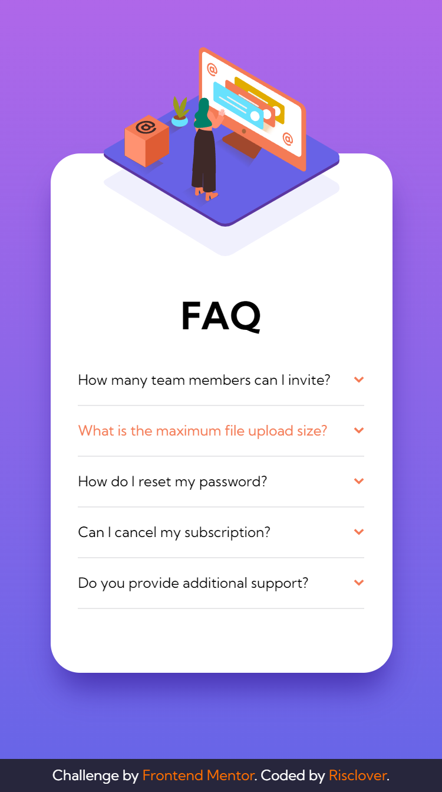
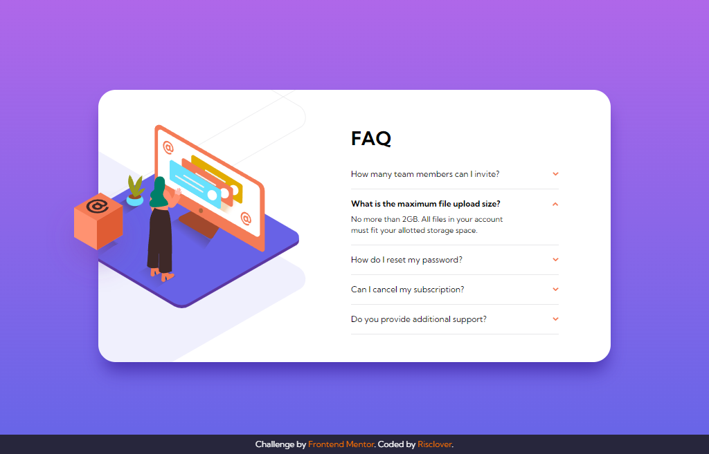

# Frontend Mentor - FAQ accordion card solution

This is a solution to the [FAQ accordion card challenge on Frontend Mentor](https://www.frontendmentor.io/challenges/faq-accordion-card-XlyjD0Oam). Frontend Mentor challenges help you improve your coding skills by building realistic projects. 

## Table of contents

- [Overview](#overview)
  - [The challenge](#the-challenge)
  - [Screenshot](#screenshot)
    - [Mobile](#mobile)
    - [Desktop](#desktop)
  - [Links](#links)
- [My process](#my-process)
  - [Built with](#built-with)
  - [What I learned](#what-i-learned)
  - [Continued development](#continued-development)
- [Author](#author)
- [Acknowledgments](#acknowledgments)

## Overview

### The challenge

Users should be able to:

- View the optimal layout for the component depending on their device's screen size
- See hover states for all interactive elements on the page
- Hide/Show the answer to a question when the question is clicked

### Screenshot

#### Mobile

#### Desktop

### Links

- [Solution URL](https://your-solution-url.com)
- [View live demo](https://risclover.github.io/FAQ-Accordion-Card/)

## My process

### Built with

- Semantic HTML5 markup
- CSS custom properties
- Flexbox
- Mobile-first workflow
- JavaScript

### What I learned

This was a fairly straightforward challenge. I'm glad I got to practice some of my newly-found JavaScript skills. I was able to duplicate the project pretty successfully in my opinion, apart from some minor differences here and there.

To achieve the image placements in Desktop mode, I had two divs - one for the main container, and one for all of the images. The main image and the background shadow image went into the image div, and the box image went into the main container. From there, all I had to do was do an absolute position for all of them (and a relative position on the div containers) and add "overflow: hidden;" to the image div to make sure that the images were hidden beyond the border.  

### Continued development

I want to continue to develop my JavaScript coding skills, and I think I might be ready to learn another programming language like Ruby or something. I'm excited for employment!

## Author

- Frontend Mentor - [@Risclover](https://www.frontendmentor.io/profile/Risclover)